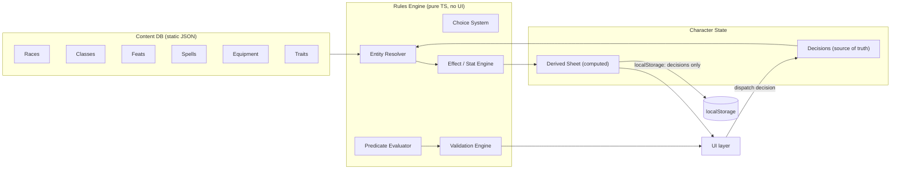

# Pathmaker — Software Design

**Pathfinder 1e Character Creator (and future interactive character sheet)**
Web app, no backend, persistence via `localStorage`.

Research basis: [d20pfsrd.com](https://www.d20pfsrd.com/) — character creation outline, race/class/feat/skill/trait/equipment structure, and character advancement rules.

---

## 1. The core problem

PF1e character creation looks like a linear 10-step checklist (abilities → race → class → skills → feats → HP → equipment → derived stats), but the steps are deeply interdependent:

- **Race** changes ability scores, grants languages, skills bonuses, weapon proficiencies, and offers *alternate racial traits* that **replace** named standard traits (e.g., an elf trait "replaces elven magic and keen senses").
- **Class** determines hit die, BAB/save progressions, class skills, skill ranks per level (**Int-dependent**, and Int may have been changed by race), proficiencies, starting wealth, and class features that carry **their own nested choices** (wizard: arcane school → 2 opposition schools + arcane bond; sorcerer: bloodline; cleric: deity → 2 domains constrained by that deity; fighter: bonus combat feats).
- **Archetypes** replace/alter class features; two archetypes are legal together **only if they don't touch the same feature**.
- **Feats** have arbitrary prerequisites over the whole character state: ability scores, BAB, skill ranks, other feats, class features, caster level, race.
- **Traits**: normally 2, no two of the same category, optional drawback grants a third; "trait" bonuses don't stack.
- **Skills**: max ranks = character level; +3 class-skill bonus only if ≥1 rank; armor check penalty applies to 8 specific skills — so **buying armor changes skill totals**.
- **Favored class bonus** options depend on the *(race, class)* pair.
- **Every numeric bonus has a type** (racial, enhancement, dodge, trait, morale, …) with per-type stacking rules.

**Conclusion:** hard-coding a step wizard with bespoke logic per step does not scale and breaks the moment the user goes back and changes an earlier choice. Instead, the design is a small **rules engine** over a **declarative content database**, with the character stored as a **list of decisions** and everything else derived.

This same engine is what later powers the interactive sheet: "click an attack → sum all active bonuses" is exactly the derived-stat computation, extended with temporary effects (spells, rage, conditions) that have durations.

---

## 2. Architecture overview



Three strictly separated layers:

1. **Content database** — static, declarative JSON describing rules content. No code.
2. **Rules engine** — pure TypeScript functions: `(content, decisions) → (sheet, availableChoices, validationIssues)`. No DOM, fully unit-testable.
3. **UI** — renders the sheet and choice pipeline, dispatches decisions. Performs **zero rules math**.

Recommended stack: **TypeScript + Vite + React**, Zustand (or React context) for state, Zod for content-schema validation at load time. No backend; content JSON ships with the app bundle.

---

## 3. Content database

### 3.1 Entities

Everything selectable is an **Entity** with a stable, namespaced ID (`race:elf`, `class:wizard`, `feat:power-attack`, `class-feature:wizard.arcane-school`, `racial-trait:elf.elven-magic`). Stable IDs are what make replacement, prerequisites, and save-file migration work.

```ts
interface Entity {
  id: string;
  kind: 'race' | 'class' | 'archetype' | 'class-feature' | 'racial-trait'
      | 'feat' | 'trait' | 'drawback' | 'skill' | 'spell' | 'item'
      | 'language' | 'deity' | 'fcb-option';
  name: string;
  description: string;          // rules text (rendered as-is in UI)
  source: string;               // e.g. "PF Core Rulebook"
  tags: string[];               // e.g. feat types: ["combat", "critical"]
  prerequisites?: Predicate;    // see §5
  effects?: Effect[];           // see §4
  choices?: ChoiceSlot[];       // nested decisions this entity opens, see §6
  replaces?: string[];          // feature IDs this removes (alternate racial traits, archetype features)
  alters?: string[];            // feature IDs this modifies (counts as touching for stacking legality)
}
```

### 3.2 Kind-specific payloads (examples)

**Race** (`race:elf`):
```jsonc
{
  "id": "race:elf",
  "kind": "race",
  "size": "medium", "type": "humanoid", "subtypes": ["elf"], "speed": 30,
  "effects": [
    { "target": "ability:dex", "type": "racial", "value": 2 },
    { "target": "ability:int", "type": "racial", "value": 2 },
    { "target": "ability:con", "type": "racial", "value": -2 }
  ],
  "grants": ["racial-trait:elf.low-light-vision", "racial-trait:elf.keen-senses",
             "racial-trait:elf.elven-immunities", "racial-trait:elf.elven-magic",
             "racial-trait:elf.weapon-familiarity"],
  "languages": { "automatic": ["language:common", "language:elven"],
                 "bonusPerIntMod": ["language:celestial", "language:draconic", "..."] },
  "alternateTraits": ["racial-trait:elf.fleet-footed", "..."]  // each has `replaces`
}
```
Races with a floating bonus (human/half-elf/half-orc `+2 to any one`) express it as a `ChoiceSlot` instead of a fixed effect.

**Class** (`class:wizard`) — progression is a 20-row table plus feature definitions:
```jsonc
{
  "id": "class:wizard", "kind": "class",
  "hitDie": 6, "skillRanksPerLevel": 2, "startingWealth": "2d6*10",
  "bab": "half", "saves": { "fort": "poor", "ref": "poor", "will": "good" },
  "classSkills": ["skill:appraise", "skill:craft.*", "skill:knowledge.*", "..."],
  "proficiencies": { "weapons": ["club", "dagger", "crossbow-light", "crossbow-heavy", "quarterstaff"], "armor": [] },
  "alignmentRestriction": null,          // e.g. monk: "lawful", paladin: "lawful-good"
  "spellcasting": {
    "type": "prepared", "list": "wizard", "ability": "int",
    "slotsTable": [[3,1],[4,2],"..."],   // row per class level, col per spell level
    "spellbook": true, "cantrips": true
  },
  "levels": {                            // features gained per class level
    "1": ["class-feature:wizard.arcane-bond", "class-feature:wizard.arcane-school",
          "class-feature:wizard.cantrips", "class-feature:wizard.scribe-scroll"],
    "5": ["class-feature:wizard.bonus-feat"], "10": ["class-feature:wizard.bonus-feat"], "...": []
  }
}
```
BAB/save progressions are the three standard curves (`full`/`three-quarter`/`half`, `good`/`poor`) computed by formula, not stored per row.

**Class feature with nested choices** (`class-feature:wizard.arcane-school`):
```jsonc
{
  "id": "class-feature:wizard.arcane-school", "kind": "class-feature",
  "choices": [
    { "id": "school", "count": 1, "from": { "kind": "class-feature", "tag": "wizard-school" } },
    { "id": "opposition", "count": 2, "from": { "kind": "class-feature", "tag": "wizard-school" },
      "excludeSelectionsOf": "school",
      "unless": { "selected": "wizard-school:universalist" } }
  ]
}
```

**Feat** (`feat:improved-critical`):
```jsonc
{
  "id": "feat:improved-critical", "kind": "feat", "tags": ["combat", "critical"],
  "prerequisites": { "all": [{ "stat": "bab", "gte": 8 }, { "feat": "feat:weapon-proficiency-with-chosen" }] },
  "choices": [{ "id": "weapon", "count": 1, "from": { "kind": "weapon-group" } }],
  "repeatable": true            // may be taken again with a different choice
}
```

**Weapons / armor** carry the stat blocks verified on d20pfsrd: weapons — cost, damage (by size), crit range/multiplier, range increment, weight, damage type, category (simple/martial/exotic), handedness (light/one-hand/two-hand), special qualities; armor — cost, AC bonus, max Dex, armor check penalty, arcane spell failure %, speed reduction, weight, category (light/medium/heavy/shield).

**Favored class bonus options** are keyed by `(race, class)` with `generic:+1hp` and `generic:+1skill` always available; racial options carry their own effects (e.g., human wizard: `+1/4 arcane school power use`, modeled as a fractional counter effect).

### 3.3 Content scope

MVP content: **Core Rulebook** — 7 core races, 11 core classes, core feats, core spells (levels 0–9 for wizard/cleric/druid/bard/sorcerer/paladin/ranger lists), core equipment, plus basic traits (APG). The schema supports everything else (base/hybrid/occult classes, archetypes, more races) as pure data additions. Content files live in `src/content/*.json`, validated by Zod schemas at build/load time.

*Licensing note:* PF1e rules content is Open Game License material (that's what d20pfsrd republishes). For personal use this is a non-issue; if the app is ever published, include the OGL 1.0a license text and Section 15 attributions.

---

## 4. Effect & stat engine

The heart of the system, and the piece the future interactive sheet reuses directly.

### 4.1 Stats as a computation graph

Every number on the sheet is a named **stat node**: `ability:str`, `mod:str` (derived), `bab`, `save:fort`, `ac`, `ac:touch`, `ac:flat-footed`, `skill:stealth`, `attack:melee`, `cmb`, `cmd`, `initiative`, `hp:max`, `speed`, `carrying-capacity`, `caster-level:wizard`, `dc:spell:wizard`, per-weapon `attack:<item-id>` / `damage:<item-id>`, etc.

Each node has a base formula over other nodes (e.g., `skill:stealth = ranks + mod:dex + classSkillBonus + acp + Σeffects`), and effects contribute additional terms. Evaluation is a straightforward topological pass — the graph is static and acyclic, so no reactive framework is needed in the engine; recompute the whole sheet on every decision change (trivially fast at this scale, and simple beats clever).

### 4.2 Effects

```ts
interface Effect {
  target: string;               // stat node, e.g. "skill:perception", "save:all-vs-enchantment"
  type: BonusType;              // "racial" | "enhancement" | "dodge" | "trait" | "morale"
                                // | "competence" | "luck" | "insight" | "sacred" | "deflection"
                                // | "natural-armor" | "armor" | "shield" | "size" | "circumstance"
                                // | "untyped" | "penalty" ...
  value: number | Formula;      // Formula: e.g. { "perLevel": "class:wizard", "div": 4 } or { "stat": "mod:cha" }
  condition?: Predicate;        // e.g. only "vs enchantment", only "when raging" — see §4.4
}
```

**Stacking rules are per-type** (verified: "trait bonuses do not stack"): same-type bonuses take the highest only, except `dodge`, `circumstance`, `untyped`, and `penalty`, which stack. This is implemented once, in one function, and every total on the sheet goes through it. This is precisely what makes "click attack → correct total" work later.

### 4.3 Conditional effects & the future play mode

Effects can carry a `condition`. Unconditional effects roll into displayed totals; conditional ones are collected and displayed as annotations ("+2 vs. enchantment", "+1 attack vs. goblins"). In the future play mode, conditions become **toggles/states** (raging, hasted, power attack on) with **durations in rounds/minutes/hours** — the engine just gains a set of "active states" and a clock; the stat math is unchanged. This is why the creator must use this engine from day one.

### 4.4 Predicates (shared DSL)

One JSON predicate language serves prerequisites, effect conditions, and choice filters:

```jsonc
{ "all": [
    { "stat": "ability:str", "gte": 13 },
    { "any": [ { "feat": "feat:power-attack" }, { "classFeature": "class-feature:fighter.bonus-feat" } ] },
    { "not": { "race": "race:elf" } },
    { "skillRanks": { "skill": "skill:acrobatics", "gte": 5 } },
    { "level": { "class": "class:wizard", "gte": 5 } }
] }
```

Evaluated against the resolved character. Kept deliberately small; the handful of genuinely weird prerequisites get an `manualNote` field the UI shows for the user to self-verify rather than contorting the DSL.

---

## 5. Character state: decisions, not values

### 5.1 The character is a build plan

The persisted character is an **ordered list of decisions grouped by level** — an event log, not a filled-in sheet:

```jsonc
{
  "schemaVersion": 3,
  "contentVersion": "core-1.0",
  "id": "uuid", "name": "Elaria", "player": "...",
  "options": { "abilityMethod": "point-buy-20", "traits": 2, "allowDrawback": true },
  "decisions": {
    "creation": [
      { "slot": "ability-scores", "value": { "str": 10, "dex": 16, "con": 12, "int": 17, "wis": 10, "cha": 8 } },
      { "slot": "race", "value": "race:elf" },
      { "slot": "race:elf/alternate-traits", "value": ["racial-trait:elf.fleet-footed"] },
      { "slot": "alignment", "value": "cg" }, { "slot": "deity", "value": "deity:desna" },
      { "slot": "favored-class", "value": "class:wizard" },
      { "slot": "traits", "value": ["trait:magical-lineage", "trait:reactionary"] }
    ],
    "levels": [
      { "level": 1, "class": "class:wizard",
        "choices": [
          { "slot": "class-feature:wizard.arcane-school/school", "value": "wizard-school:evocation" },
          { "slot": "class-feature:wizard.arcane-school/opposition", "value": ["wizard-school:enchantment", "wizard-school:necromancy"] },
          { "slot": "class-feature:wizard.arcane-bond", "value": { "kind": "familiar", "choice": "familiar:owl" } },
          { "slot": "feat", "value": "feat:spell-focus", "subChoices": [{ "slot": "school", "value": "evocation" }] },
          { "slot": "skills", "value": { "skill:spellcraft": 1, "skill:knowledge.arcana": 1, "...": 1 } },
          { "slot": "fcb", "value": "generic:+1skill" },
          { "slot": "spellbook", "value": ["spell:magic-missile", "spell:mage-armor", "..."] },
          { "slot": "hp", "value": "max" }        // level 1 = max; later levels: rolled value or "average"
        ] },
      { "level": 4, "...": "...", "choices": [ { "slot": "ability-increase", "value": "int" }, "..." ] }
    ],
    "purchases": [ { "item": "item:quarterstaff", "qty": 1 }, { "item": "item:spell-component-pouch", "qty": 1 } ],
    "equipped": { "armor": null, "mainHand": "item:quarterstaff" }
  }
}
```

Why this shape:

- **Editing earlier choices is safe.** Change race and the engine re-resolves everything; decisions that are now invalid (a feat whose prerequisite broke, an alternate trait that no longer exists) aren't silently deleted — they surface as **validation issues** the user resolves (see §7).
- **Level-up is free.** Leveling appends a level record; the creator and the level-up flow are the *same* pipeline (creation = levels 1..N with the same code path). This directly matches the advancement rules: HP, skill ranks, BAB/saves by class table, feat at odd levels, ability +1 at levels 4/8/12/16/20, FCB choice per favored-class level, multiclassing = a level record with a different `class`.
- **Retraining and undo** are list edits.
- **Storage is tiny and stable** — no derived numbers persisted, so engine fixes retroactively correct old characters.

### 5.2 Resolution pipeline

```
decisions ──► resolve entities (race, classes, feats, features; apply `replaces`)
          ──► collect ChoiceSlots (some now filled, some open)
          ──► gather Effects from all resolved entities + equipped items
          ──► evaluate stat graph  ──► Sheet (view model)
          ──► evaluate validations ──► Issue list
          ──► for each open/filled slot: filter legal options via predicates ──► Choice view models
```

Pure function, re-run in full on every change. The UI consumes only `Sheet`, `ChoiceSlot[]`, and `Issue[]`.

---

## 6. Choice system

A **ChoiceSlot** is a uniform "pick N of a filtered set" primitive:

```ts
interface ChoiceSlot {
  id: string;                    // stable path, e.g. "class-feature:wizard.arcane-school/school"
  label: string;
  count: number | Formula;       // e.g. skill ranks: {"stat":"skill-ranks-this-level"}; languages: {"stat":"mod:int"}
  from: EntityFilter;            // kind + tags + predicate, evaluated per option
  distinct?: boolean;
  unless?: Predicate;            // slot doesn't exist if true (universalist → no opposition schools)
}
```

Everything funnels through it: ability method, race, alternate racial traits (options carry `replaces` → engine enforces no double-replacement), class per level, archetypes (legality = no overlap in `replaces ∪ alters` between selected archetypes), class-feature choices (schools, bloodlines, domains-filtered-by-deity via predicate on the option), feats (filter = prerequisites met; fighter bonus feat slot filters `tag:combat`), traits (validation: no two same category; drawback adds a slot), skills (a numeric allocation slot with per-skill cap = level), spells known/spellbook, FCB, languages, equipment purchases (filter = affordable).

Because slots are declared *by entities in content*, adding a new class with novel choices requires no engine code — just content.

---

## 7. Validation engine

Non-blocking, whole-character validation instead of a locked wizard. Each rule emits:

```ts
interface Issue {
  severity: 'error' | 'warning' | 'info';
  slot?: string;                 // where to jump to fix it
  message: string;               // human-readable, e.g. "Power Attack requires Str 13 (you have 12)"
}
```

Rule inventory (from research): unspent points (point-buy, skill ranks, gold, missing choices) → `info/warning`; broken feat/trait/archetype prerequisites after an upstream edit → `error` with the exact failed clause; skill ranks > level → `error`; two traits of same category, two archetypes touching the same feature, alternate traits replacing an already-replaced trait, alignment vs class restriction, opposition-school spells double-slot accounting, encumbrance vs Str, proficiency mismatches (warning: "not proficient with longsword: −4 attack") → `error`/`warning` as appropriate.

**A character with issues is still savable.** Errors are only a gate for an optional "mark as legal/complete" flag.

---

## 8. Persistence

- `localStorage` keys: `pathmaker:index` (roster: id, name, class summary, portrait, updatedAt) and `pathmaker:char:<uuid>` (the decisions document above). Roster screen lists many characters.
- **Versioned migrations**: `schemaVersion` on every document; pure migration functions `v(n) → v(n+1)` run at load.
- **Export/import** as a `.json` file download/upload — this is also the backup story, since localStorage is device-bound and evictable. Autosave on every decision (debounced), plus a small undo ring buffer in memory.
- Content is bundled with the app; `contentVersion` recorded per character so future content changes can warn on mismatch.

---

## 9. Module layout

```
src/
  content/          # JSON data + Zod schemas (races.json, classes/, feats.json, spells/, items/, traits.json)
  engine/
    entities.ts     # resolver, replaces/alters handling
    effects.ts      # bonus typing + stacking (one function, heavily unit-tested)
    stats.ts        # stat node definitions + evaluation
    predicates.ts   # predicate DSL evaluator
    choices.ts      # slot collection + option filtering
    validate.ts     # rule inventory (§7)
    sheet.ts        # Sheet view-model assembly
    levelup.ts      # level record scaffolding (feat-at-odd-levels, ability-at-4th, etc.)
  storage/          # localStorage adapter, migrations, import/export
  ui/               # React app (see HANDOVER-UI.md)
```

Engine ships with a **golden-character test suite**: hand-computed reference sheets (e.g., level 1 elf wizard, level 5 half-orc fighter with Power Attack + masterwork falchion, a multiclassed cleric/rogue) asserted number-by-number. This is the regression net for all future content and engine changes.

---

## 10. Roadmap fit (future phases, designed-for now)

| Future feature | Already covered by |
| --- | --- |
| Level-up | Level records + same choice pipeline (§5.1) |
| Spell/resource tracking | Per-day pools are stat nodes (`slots:wizard:3`, `uses:channel-energy`); play mode adds a `used` counter layer |
| Time tracking | Durations on temporary effects + a campaign clock advancing rounds/minutes/days; rest event resets pools |
| One-click attack totals | Effect engine + typed stacking (§4); play mode adds toggleable states (rage, haste, power attack) |
| Equipment management | Items are entities with effects; `equipped` state already separate from `owned` |
| Conditions (fatigued, shaken…) | Conditions are entities with effects + a state toggle |
